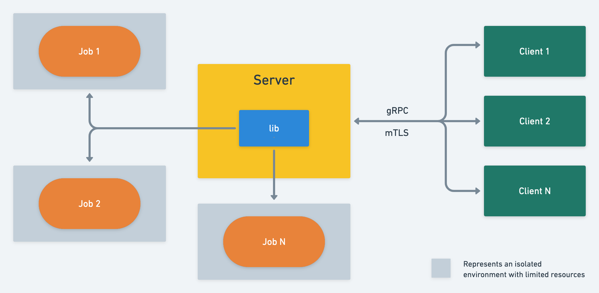

# Runner

Runner is a tool to easily run and manage jobs on a Linux machine. This document describes the
functional and design aspects of Runner.

## Requirements

### Library

* [ ] A method to perform the following operations on a job
    - [ ] Start
    - [ ] Stop
    - [ ] Query status
    - [ ] Stream output
* [ ] Output of a job should always be from the beginning of the job
* [ ] Multiple clients should be able to concurrently retrieve output of a running job
* [ ] Resource control per job using cgroups
    - [ ] CPU
    - [ ] Memory
    - [ ] Disk IO
* [ ] Resource isolation for using PID, mount and networking namespaces

### Server

* [ ] gRPC API to perform the following operations on a job
    - [ ] Start
    - [ ] Stop
    - [ ] Query status
    - [ ] Stream output
* [ ] mTLS must be used for authentication between the client(s) and the server
    - [ ] A strong set of cipher suits must be used
* [ ] A simple authorization scheme is enough for the scope of this project

### Client

* [ ] One or more clients should be able to perform the following operations on a job concurrently
    - [ ] Start
    - [ ] Stop
    - [ ] Query status
    - [ ] Stream output

### Misc

* [ ] Build script to perform the following operations
    - [ ] Build client and server binaries for Linux platform
    - [ ] Run tests on the entire codebase
    - [ ] Generate code coverage report


## Design

The following diagram shows the major components of Runner and their interaction surfaces. Each
component and their interaction with other components are explained in more detail in the following
sections.



### Library

The library implements all the jobs management interfaces for the server. The server uses the library to
start, stop jobs as well as check the status of and stream output from the existing jobs.

#### Job Management

A job has the following attributes that are provided by the user of the library:
  - `path`: The path to the command/executable that needs to be executed as the job.
  - `args`: Arguments to be passed to the command/executable.
  creation. Client must provide the job id for subsequent operations on the job.
  - `timeout`: Timeout duration in seconds to wait for the job to complete. If the job doesn't
  complete within the specified timeout, the job will be stopped by the library. A timeout of 0
  seconds is interpreted as no timeout.

The following attributes are maintained by the library for each job:
  - `id`: The unique identifier of the job. It is generated automatically by the library upon job
  - `status`: The status of the job.
  - `exitCode`: The exit code of the job.
  - `outFile`: The path to the file where output of the job is written to. File path is of the
  format `/tmp/runner/<job-id>`.

##### Public interfaces

The following public interfaces are exposed by the library package.

```go

// JobConfig represents the input configuration for a job
type JobConfig struct {
  Path string
  Args []string
  Timeout time.Duration
}

// Job represents a job
//
// TODO: Think about exposing an interface rather than the Job struct itself. Provides flexibility
// to the user during testing.
type Job struct {
}

func NewJob(c Config) (*Job, error) {}

// Start starts a newly created job
func (j *Job) Start() error {}

// Stop stops a running job
func (j *Job) Stop() error {}

type JobStatus int
const (
  // StatusUnknown is returned when the status of the job cannot be determined
  StatusUnknown JobStatus = iota
  // StatusRunning is returned when the job is still running
  StatusRunning
  // StatusCompleted is returned when the job runs to its completion itself
  StatusCompleted
  // StatusStopped is returned when the job is stopped by the user
  StatusStopped
  // StatusKilled is returned when the timeout expires and the job is killed
  StatusKilled
)
func (j *Job) Status() (JobStatus, error) {}

// Line represents a single line of output from the job. Using a struct here provides flexibility to
// include metadata about the line in the future while keeping the package backward compatible.
// e.g. timestamp or where the line was captured from - stdout vs stderr.
type Line struct {
  Bytes []byte
}
func (j *Job) Output() (<-chan *Line, error) {}
```

Some important considerations for the library:
  - State of all the jobs are only maintained in-memory. This information is not persisted anywhere.
  - Library allows concurrent access to the jobs. Multiple goroutines may perform operations
  simultaneously on the job.
  - A job that has been stopped cannot be started again. A new job has to be created with same input
  parameters for rerun of the job.

#### Job Resource Limitation 

Each job created using the library is resource limited using cgroups v2. cgroup name for all the
jobs is called `runner`.

As mentioned in the requirements section, library limits access to 3 resources for each job - cpu,
memory and disk IO. Library limits each job's resources by adding the job's PID to the `runner`
cgroup -
  - `/sys/fs/cgroup/cpu/runner/cgroup.procs`
  - `/sys/fs/cgroup/memory/runner/cgroup.procs`
  - `/sys/fs/cgroup/blkio/runner/cgroup.procs`

TODO: Decide the actual limits for cpu, memory and blkio.

#### Job Resource Isolation

Library isolates each job by creating a separate namespace for PID, mount and network. This is
achieved by setting `CLONE_NEWPID`, `CLONE_NEWNS` and `CLONE_NEWNET` clone flags during the job
creation.

### Server

The server component utilizes the library to provide job management services to the client over a
gRPC channel. Refer to the [protobuf specification](proto/runner.proto) for more details on the gRPC
service and the messages.

### Client

The client component invokes the RPC methods exposed by the server's gRPC service.

The following actions are available to the user of the client.

#### `start`

The `start` action is used to start a new job. The following parameters are required for the `start`
action.

  - `path`: The path to the command that should be executed
  - `args`: The arguments to be passed to the command
  - `timeout`: Timeout in seconds. Timeout is optional, defaults to 0 when not provided.

If the job is started successfully by the server, a job id is returned to the client in response.
This job id is required to perform subsequent operations on the job.

#### `stop`

The `stop` action is used to stop a job. It takes only a single parameter called `job_id`.

#### `status`

The `status` action is used to fetch status of a previously created job. It takes only a single
parameter called `job_id`. Status of a job can be `Unknown`, `Running`, `Completed`, `Stopped` or
`Killed`. If the job was stopped because of the timeout expiry, it's status is considered `Killed`.

#### `output`

The `output` action is used to fetch the output generated by the job. It takes only a single
parameter called `job_id`. The job output is streamed from the server and printed on the console
line by line. Multiple clients may stream the output of the same job simultaneously. Output always
starts from the beginning.

### Authentication

The client and the server use mTLS to securely communicate with each other. A private certificate
authority (CA) is used to generate the Root CA, which is used to sign the certificates for the
clients and the server. The server and the clients verify each other's certificates using the common
Root CA. This way, new client certificates can be generated without modifying the server.

Parameters for generating Root CA and certificates -
  - 2048 bytes long key
  - AES256 key encryption using a password
  - SHA256 as digest algorithm for signing requests

Server is configured with TLS 1.2 as the minimum required version. The following ciphers are
configured on the server -

  - `TLS_DHE_RSA_WITH_AES_256_CBC_SHA`
  - `TLS_DHE_DSS_WITH_AES_256_CBC_SHA`
  - `TLS_RSA_WITH_AES_256_CBC_SHA`
  - `TLS_DHE_RSA_WITH_3DES_EDE_CBC_SHA`
  - `TLS_DHE_DSS_WITH_3DES_EDE_CBC_SHA`
  - `TLS_RSA_WITH_3DES_EDE_CBC_SHA`
  - `TLS_DHE_RSA_WITH_AES_128_CBC_SHA`
  - `TLS_DHE_DSS_WITH_AES_128_CBC_SHA`
  - `TLS_RSA_WITH_AES_128_CBC_SHA`

### Authorization

The job id is used as the means to authorize the client. A client must provide the job id in order
to perform an operation on the job. It is up to the client to ensure that the id returned in
response to the `start` request is stored securely.

TODO: Expand on the authorization scheme.
